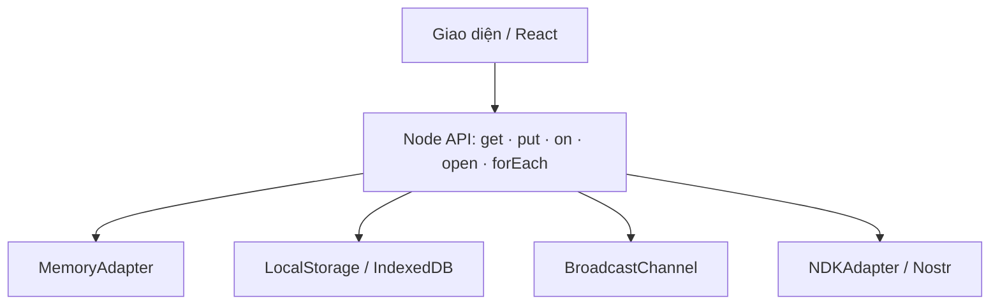

<div align="center">


<h1>🌳 BilaTree</h1>

<p><strong>Cây trạng thái có thể đăng ký, lưu cục bộ và đồng bộ qua nhiều phương thức</strong></p>

<p>
  <a href="LICENSE"></a>
  <a href="https://www.typescriptlang.org/"></a>
  <a href="https://nostr.com/"></a>
  <a href="https://base27-cvnss.github.io/bilatree/"></a>
</p>

<p>
  <a href="https://base27-cvnss.github.io/bilatree/">🌐 Trải nghiệm BilaTree</a> ·
  <a href="https://treelike.iris.to/">📘 Tài liệu API</a> ·
  <a href="https://github.com/Base27-CVNSS/bilatree">💻 Mã nguồn</a> ·
  <a href="https://github.com/Base27-CVNSS/bilatree/issues">🐞 Báo lỗi</a>
</p>

</div>

---

## ✨ BilaTree là gì?

BilaTree là một cấu trúc dữ liệu dạng cây dành cho TypeScript/JavaScript. Mỗi nút vừa là một đường dẫn truy vấn, vừa có thể nhận dữ liệu mới theo thời gian thực thông qua cơ chế đăng ký. Dữ liệu thực tế không bị khóa trong lớp `Node`; nó được lưu và truyền bởi các **adapter** có thể thay thế.

Nhờ cách tách này, cùng một API có thể phục vụ ba phạm vi:

- 🖥️ **Một tiến trình:** giữ trạng thái nhanh trong bộ nhớ.
- 🪟 **Nhiều tab trình duyệt:** lưu bền bằng `localStorage` hoặc IndexedDB và phát thay đổi bằng `BroadcastChannel`.
- 🌐 **Nhiều người dùng/thiết bị:** đồng bộ trạng thái công khai qua Nostr, nơi danh tính là khóa công khai.

Ứng dụng phù hợp gồm bảng điều khiển thời gian thực, trình soạn thảo cộng tác, cấu hình người dùng, ứng dụng local-first và giao diện xã hội phi tập trung.

> **Bản chất:** BilaTree không phải cơ sở dữ liệu hoàn chỉnh và không phải blockchain. Đây là lớp mô hình trạng thái nhỏ gọn đặt giữa giao diện ứng dụng và các kênh lưu trữ/đồng bộ.

## 🚀 Bắt đầu nhanh

### Chỉ dùng trạng thái cục bộ

```bash
npm install treelike
```

```ts
import { localState } from 'treelike';

const tenNode = localState.get('nguoi-dung/ho-so/ten');

const huyDangKy = tenNode.on((giaTri) => {
  console.log('Tên vừa thay đổi:', giaTri);
});

await tenNode.put('Long Ngo');
huyDangKy();
```

### Đồng bộ trạng thái qua Nostr

```bash
npm install treelike treelike-nostr nostr-tools \
  @nostr-dev-kit/ndk @nostr-dev-kit/ndk-cache-dexie
```

### Dùng với React

```bash
npm install react treelike treelike-hooks
```

```tsx
import { useLocalState } from 'treelike-hooks';

export function HoSo() {
  const [ten, setTen] = useLocalState('nguoi-dung/ho-so/ten', 'Chưa đặt tên');

  return <input value={ten} onChange={(e) => setTen(e.target.value)} />;
}
```

## 🧠 Nguyên lý hoạt động



1. `get('a/b/c')` tạo hoặc lấy một đối tượng `Node` đại diện cho đường dẫn.
2. `put(value)` ghi một `NodeValue` gồm giá trị, thời điểm cập nhật và thời điểm hết hạn tùy chọn vào mọi adapter.
3. `on(callback)` đăng ký tại một nút; `forEach(callback)` theo dõi từng nút con; `open(callback)` gom các nút con thành một đối tượng.
4. Adapter đọc dữ liệu hiện có và phát thay đổi mới về cùng giao diện callback.
5. Dấu thời gian giúp bỏ qua bản ghi cũ hơn trong luồng nhận; đối tượng được sao chép trước khi thông báo để giảm rò rỉ tham chiếu.

## 🏗️ Kiến trúc monorepo

| Gói              | Vai trò                      | Thành phần chính                                                 |
| ---------------- | ---------------------------- | ---------------------------------------------------------------- |
| `treelike`       | Lõi cây trạng thái           | `Node`, kiểu JSON, trạng thái cục bộ, adapter bộ nhớ/trình duyệt |
| `treelike-nostr` | Cầu nối mạng Nostr           | `NDKAdapter`, `publicState`, chuẩn hóa khóa công khai            |
| `treelike-hooks` | Liên kết React               | `useLocalState`, `usePublicState`, `useNodeState`, `useAuthors`  |
| Website root     | Cổng giới thiệu và phòng thử | UI tiếng Việt, cây trực quan, lưu cục bộ, đồng bộ giữa tab       |

### Hợp đồng adapter

Adapter chỉ cần thực hiện hai trách nhiệm cốt lõi:

- `get(path, callback)`: đọc giá trị và tiếp tục phát thay đổi; trả về hàm hủy đăng ký.
- `set(path, nodeValue)`: ghi giá trị cùng metadata thời gian.

Vì lõi không phụ thuộc phương tiện vận chuyển, nhà phát triển có thể bổ sung adapter WebSocket, REST, SQLite hoặc một mạng ngang hàng mà không đổi API của giao diện.

## 🧩 Các adapter tích hợp

| Adapter                     |  Lưu bền  |          Đồng bộ          | Trường hợp dùng                          |
| --------------------------- | :-------: | :-----------------------: | ---------------------------------------- |
| `MemoryAdapter`             |    ❌     |     Trong tiến trình      | Kiểm thử, cache, trạng thái tạm          |
| `LocalStorageAdapter`       |    ✅     |    Qua sự kiện storage    | Cấu hình nhỏ trong trình duyệt           |
| `IndexedDBAdapter`          |    ✅     |    Theo cơ chế adapter    | Dữ liệu trình duyệt lớn hơn              |
| `BroadcastChannelAdapter`   |    ❌     |       Giữa các tab        | Cập nhật tức thời trong cùng trình duyệt |
| `LocalStorageMemoryAdapter` |    ✅     |     Trong tiến trình      | Kết hợp tốc độ bộ nhớ và lưu bền         |
| `NDKAdapter`                | Qua relay | Nhiều thiết bị/người dùng | Trạng thái công khai ký bằng khóa Nostr  |

## 🧪 Phòng thử giao diện

Trang [BilaTree tiếng Việt](https://base27-cvnss.github.io/bilatree/) minh họa trực tiếp ba hành vi:

- nhập đường dẫn như `du-an/bilatree/trang-thai` và một giá trị JSON;
- dựng cây dữ liệu tức thời và lưu trạng thái sau khi tải lại trang;
- mở hai tab để quan sát sự kiện được chuyển qua `BroadcastChannel`.

Demo cố ý chạy hoàn toàn trong trình duyệt, không tải dữ liệu cá nhân lên máy chủ. Kết nối Nostr trên bảng trạng thái là phần mô tả kiến trúc; demo không tự động phát sự kiện ra relay công cộng.

## ⚖️ Ưu điểm và giới hạn

| Ưu điểm                                | Giới hạn cần hiểu đúng                                 |
| -------------------------------------- | ------------------------------------------------------ |
| API nhỏ, đường dẫn trực quan           | Chưa cung cấp truy vấn quan hệ/phân tích như SQL       |
| Adapter tách biệt khỏi logic giao diện | Chiến lược xung đột chủ yếu dựa trên dấu thời gian     |
| Phù hợp kiến trúc local-first          | Đồng hồ thiết bị sai có thể ảnh hưởng thứ tự cập nhật  |
| Đăng ký thay đổi theo thời gian thực   | Cần tự thiết kế phân quyền và xác thực theo ứng dụng   |
| Có cầu nối Nostr và hooks React        | Relay Nostr có độ tin cậy/chính sách lưu trữ khác nhau |

### Lưu ý an toàn

- Không đặt khóa bí mật, token hoặc dữ liệu nhạy cảm vào trạng thái công khai Nostr.
- `localStorage` không được mã hóa; tránh dùng cho bí mật dài hạn.
- Luôn kiểm tra kiểu và kích thước dữ liệu từ relay trước khi hiển thị.
- Hủy đăng ký khi component bị tháo để tránh rò rỉ tài nguyên.
- Với cộng tác quan trọng, hãy bổ sung chiến lược xử lý xung đột phù hợp như CRDT hoặc version vector.

## 🛠️ Phát triển

Yêu cầu Node.js 20 trở lên và npm.

```bash
git clone https://github.com/Base27-CVNSS/bilatree.git
cd bilatree
npm ci
npm run build
npm test
```

Kiểm tra riêng website tĩnh:

```bash
npm run site:check
```

## 🗺️ Lộ trình đề xuất

- [x] Giao diện tiếng Việt responsive và demo cây tương tác.
- [x] Lưu cục bộ, đồng bộ giữa tab, chế độ sáng/tối và khả năng truy cập bàn phím.
- [x] Tài liệu kiến trúc, giới hạn, bảo mật và ví dụ React/Nostr.
- [ ] Adapter WebSocket/SQLite tham chiếu.
- [ ] Bộ benchmark cho tải ghi, độ trễ thông báo và mức dùng bộ nhớ.
- [ ] Cơ chế giải quyết xung đột nâng cao cho chỉnh sửa cộng tác.
- [ ] Tài liệu API tiếng Việt sinh tự động từ TSDoc.

## 👤 Tác giả và nguồn gốc

- **Phát triển bản BilaTree tiếng Việt, giao diện và tài liệu:** Long Ngo — [Base27-CVNSS](https://github.com/Base27-CVNSS).
- **Tác giả dự án Treelike nguyên gốc:** Martti Malmi — [irislib/treelike](https://github.com/irislib/treelike).
- Thiết kế trải nghiệm lấy cảm hứng từ [Iris](https://iris.to/) nhưng BilaTree là dự án tài liệu/demo độc lập, không tự nhận là sản phẩm chính thức của Iris.

Việc ghi rõ nguồn gốc giữ nguyên quyền tác giả và giúp người dùng phân biệt phần lõi thượng nguồn với phần Việt hóa/mở rộng.

## 📄 Giấy phép

Phát hành theo [Giấy phép MIT](LICENSE). Bạn có thể sử dụng, sao chép, sửa đổi, hợp nhất, xuất bản, phân phối, cấp phép lại và thương mại hóa với điều kiện giữ lại thông báo bản quyền và giấy phép.

---

<div align="center">

Được phát triển bằng ❤️ cho cộng đồng nguồn mở Việt Nam bởi **Long Ngo**.

</div>
