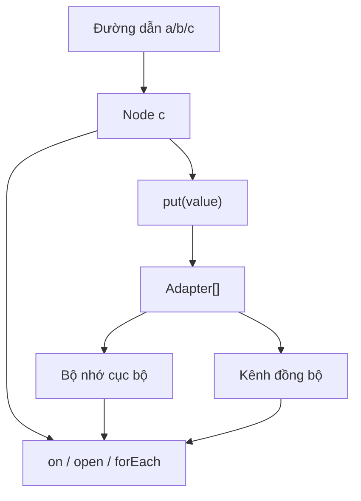
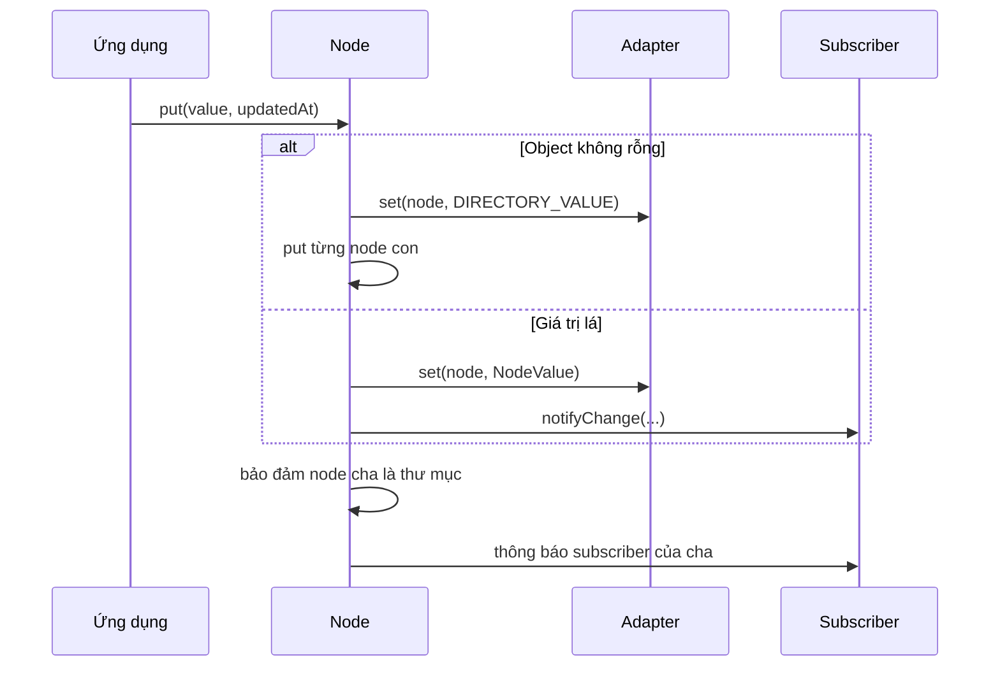
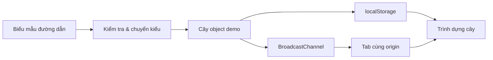

# 🏗️ Kiến trúc BilaTree

Tài liệu này giải thích **bản chất, nguyên lý, luồng dữ liệu và giới hạn** của BilaTree/Treelike. Mục tiêu là giúp người phát triển biết hệ thống đang làm gì, thay vì chỉ sao chép API.

## 1. Mô hình tinh thần

BilaTree gồm ba khái niệm chính:

1. **Đường dẫn:** địa chỉ phân cấp như `/ung-dung/tai-lieu/tieu-de`.
2. **Node:** đối tượng truy vấn đại diện cho một đường dẫn.
3. **Adapter:** lớp thực thi lưu trữ hoặc vận chuyển dữ liệu.



Node không cần biết adapter là RAM, IndexedDB hay relay Nostr. Adapter cũng không cần biết dữ liệu sẽ được hiển thị bằng React hay một tiến trình nền.

## 2. Cấu trúc của `NodeValue`

Adapter trao đổi một bản ghi logic có dạng:

```ts
interface NodeValue<T = JsonValue> {
  value: T;
  updatedAt: number;
  expiresAt?: number;
}
```

| Trường | Ý nghĩa |
|---|---|
| `value` | dữ liệu JSON của node |
| `updatedAt` | dấu thời gian dùng để xác định bản mới hơn |
| `expiresAt` | thời điểm hết hạn tùy chọn |

`updatedAt` là cơ sở của quy tắc **latest-wins**. Nếu subscriber đã biết một giá trị có dấu thời gian mới hơn hoặc bằng, giá trị cũ được bỏ qua.

## 3. Quy tắc biểu diễn cây

### 3.1 Giá trị lá

Chuỗi, số, boolean, `null` và mảng được xem như giá trị tại một node.

### 3.2 Object có thuộc tính

Object không rỗng được tách thành node con. Lệnh:

```ts
root.get('ho-so').put({ ten: 'Long Ngo', ngonNgu: 'vi-VN' });
```

tạo logic tương đương:

```text
/ho-so                 {}
/ho-so/ten             "Long Ngo"
/ho-so/ngonNgu         "vi-VN"
```

### 3.3 Dấu hiệu thư mục

Object rỗng `{}` là `DIRECTORY_VALUE`. Nó cho biết node có vai trò nhánh và subscriber có thể mở các node con qua `open()` hoặc `forEach()`.

## 4. Vòng đời một lệnh `put`



Điểm quan trọng:

- ghi vào một node có thể kéo theo ghi dấu thư mục ở node cha;
- nhiều adapter được gọi song song bằng `Promise.all`;
- callback cục bộ được thông báo sau khi node chuẩn bị bản ghi;
- adapter mạng có thể gửi lại dữ liệu bất đồng bộ ở thời điểm khác.

## 5. Các kiểu subscription

| API | Phạm vi | Mô hình sử dụng |
|---|---|---|
| `on()` | một node; có thể mở sâu khi gặp thư mục | theo dõi giá trị tại địa chỉ |
| `forEach()` | từng node con | danh sách động hoặc event stream |
| `open()` | tổng hợp node con thành object | dựng trạng thái object từ cây |

Mọi API trả về một hàm `unsubscribe`. Component hoặc dịch vụ dài hạn phải gọi hàm này khi kết thúc vòng đời để tránh callback thừa.

## 6. Hệ adapter

### `MemoryAdapter`

- lưu `Map<string, NodeValue>` trong RAM;
- nhanh, dễ test;
- mất khi tiến trình hoặc trang đóng.

### `LocalStorageMemoryAdapter`

- nạp Web Storage vào Map;
- đọc nhanh từ RAM và ghi bền xuống `localStorage`;
- phù hợp dữ liệu nhỏ, cùng origin;
- không nên chứa secret dài hạn.

### `IndexedDBAdapter`

- lưu bền trong cơ sở dữ liệu trình duyệt;
- phù hợp dữ liệu lớn/có cấu trúc hơn Web Storage;
- thao tác bất đồng bộ và cần xử lý quota/lỗi môi trường.

### `BroadcastChannelAdapter`

- phát cập nhật giữa các tab/cửa sổ cùng origin;
- không phải nơi lưu bền;
- thường ghép cùng adapter lưu trữ cục bộ.

### `NDKAdapter`

- ánh xạ đường dẫn và giá trị sang sự kiện Nostr;
- đọc theo khóa tác giả, loại sự kiện và relay;
- mở rộng phạm vi từ một trình duyệt sang nhiều thiết bị/người dùng;
- tính sẵn có, độ trễ và lưu giữ phụ thuộc relay/cache.

## 7. Local-first không có nghĩa là “luôn offline”

Local-first là thứ tự ưu tiên kiến trúc:

1. ứng dụng có trạng thái cục bộ để phản hồi nhanh;
2. thao tác không nhất thiết phải chờ máy chủ trung tâm;
3. đồng bộ là lớp bổ sung;
4. khi mạng gián đoạn, ứng dụng vẫn nên giữ được trải nghiệm cốt lõi;
5. khi mạng trở lại, adapter quyết định cách trao đổi phiên bản.

BilaTree cung cấp các khối nền, nhưng ứng dụng vẫn phải thiết kế chính sách xung đột và retry phù hợp.

## 8. Xung đột và tính nhất quán

Quy tắc theo `updatedAt` có các đặc điểm:

- đơn giản và rẻ;
- hội tụ tốt khi đồng hồ đủ gần và cập nhật không cạnh tranh phức tạp;
- có thể mất ý định người dùng nếu hai thiết bị sửa cùng một node;
- nhạy với đồng hồ hệ thống sai;
- không thể tự hợp nhất hai nhánh văn bản.

Nếu sản phẩm cần cộng tác nhiều người trên cùng tài liệu, hãy đặt CRDT/OT phía trên hoặc dùng cấu trúc sự kiện có thể hợp nhất thay vì chỉ latest-wins.

## 9. Biên an toàn

### Dữ liệu đầu vào

- kiểm tra kiểu/schema trước `put`;
- hạn chế độ sâu, kích thước và tên segment;
- chặn `__proto__`, `prototype`, `constructor` khi dựng object động;
- không tin dữ liệu đến từ relay hoặc tab khác.

### Khóa và nội dung Nostr

- không lưu private key dạng rõ trong Web Storage;
- ưu tiên signer/extension hỗ trợ NIP-07 hoặc giải pháp quản lý khóa phù hợp;
- ký sự kiện không đồng nghĩa mã hóa nội dung;
- relay có thể ghi log metadata và sao chép sự kiện công khai.

### Vòng đời subscription

- luôn giữ và gọi `unsubscribe`;
- giới hạn recursion khi mở cây sâu;
- tránh callback làm công việc nặng trên luồng UI.

## 10. Giới hạn kiến trúc hiện tại

| Giới hạn | Tác động | Hướng mở rộng |
|---|---|---|
| latest-wins đơn giản | xung đột có thể ghi đè | CRDT hoặc version vector |
| schema tùy ứng dụng | dữ liệu sai kiểu lọt vào | Zod/Valibot/type guard |
| không transaction đa node | trạng thái trung gian có thể quan sát | batching/transaction adapter |
| query chủ yếu theo đường dẫn | khó lọc/tổng hợp lớn | chỉ mục phụ/search adapter |
| relay Nostr không bảo đảm riêng tư | lộ nội dung/metadata | mã hóa và chính sách relay |

## 11. Kiến trúc demo website

Demo GitHub Pages là ứng dụng tĩnh, không phụ thuộc máy chủ:



Demo minh họa hành vi local-first và event-driven. Nó không thay thế package `treelike` và không gửi dữ liệu đến Nostr.

## 12. Quyết định thiết kế của bản BilaTree

- giữ nguyên core API để không phá người dùng Treelike;
- bổ sung tài liệu tiếng Việt thay vì đổi tên symbol công khai;
- website thuần HTML/CSS/JavaScript để Pages tải nhanh và dễ kiểm tra;
- không tải font, analytics hoặc SDK bên thứ ba;
- bảo lưu ghi công Martti Malmi/irislib;
- giấy phép MIT cho phần bổ sung của Long Ngo và toàn bộ bản phân phối.

---

Quay lại [README chính](../README.md) · Xem [API tiếng Việt](API_VI.md)
